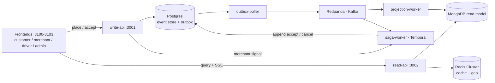
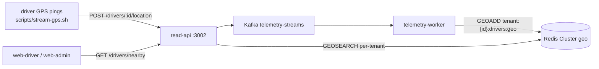

# FlashBite

A multi-tenant, hyper-local delivery platform built as a **distributed-systems
architecture showcase** — one order journey taken end-to-end through every serious
backend pattern, with a second tenant present purely to prove isolation.

> Portfolio / learning project. The value is depth: each pattern is built in
> "hard mode," and the whole thing runs locally end-to-end.

---

## What it demonstrates

A single order flows through **every box** in the architecture (CQRS: an event-sourced write
plane and a projected read plane, joined by Kafka):



Plus a real-time **telemetry plane** (ephemeral — Redis geo only, never persisted):



> **Full architecture (components, sequence diagrams, data model):**
> [`docs/ARCHITECTURE.md`](docs/ARCHITECTURE.md).

**Built today (Phase 0 + 1):**

- **CQRS + Event Sourcing + Transactional Outbox** — order events + outbox row committed in one
  Postgres transaction (Prisma); forward-only, rebuildable Mongo projections.
- **Kafka (via Redpanda)** — JSON envelopes, per-order partition keys (`tenantId:orderId`) for
  ordering. *(Avro + Schema Registry: planned, Phase 3.)*
- **Temporal sagas** — one workflow per order: charge → per-tenant SLA timer raced against the
  merchant-approval signal → accept, or compensate (refund + cancellation with a reason). Payment
  is a fake activity for now.
- **Polyglot persistence** — Postgres (event store), Mongo (read models + inbox), Redis Cluster
  (cache + geo, `tenant:{id}` hash-tag co-location).
- **Real-time telemetry** — ephemeral driver GPS (`DriverTelemetryStreamed` on `telemetry-streams`)
  into per-tenant Redis geo indices, served via `GEOSEARCH` (`GET /drivers/nearby`); never
  persisted.
- **Idempotency & dedup** — at every hop: stable `eventId`, Mongo inbox pattern, Temporal
  `WorkflowId = tenantId:orderId` reject-duplicate reuse policy.
- **Four Next.js frontends** — customer, merchant (live SSE), driver (Mapbox), admin (cross-tenant
  analytics), on a shared design system.
- **Multi-tenancy** — `tenantId` threaded through every tier (Kafka keys, Mongo ids, Redis hash
  tags). Resolution is the `X-Tenant-ID` header today.

**Planned (later phases):** a dedicated **identity service + verified JWT** and **Postgres
Row-Level Security** (Phase 2) replace the trusted header; **Avro + Schema Registry**, a real
payment provider, and **driver dispatch** come later. See `docs/superpowers/backlog.md`.

See the **current architecture** in [`docs/ARCHITECTURE.md`](docs/ARCHITECTURE.md), and the original
vision in
[`docs/superpowers/specs/2026-06-13-flashbite-showcase-design.md`](docs/superpowers/specs/2026-06-13-flashbite-showcase-design.md).

---

## Tech stack

NestJS · Next.js 16 · Kafka (Redpanda) · Temporal · PostgreSQL + Prisma · MongoDB ·
Redis Cluster · recharts · react-map-gl · TypeScript · pnpm monorepo · Docker Compose.
*(Schema Registry / Avro and a JWT identity service are planned, not yet wired.)*

## Monorepo layout

```
apps/        write-api, read-api, outbox-poller, projection-worker, saga-worker,
             telemetry-worker, web-customer, web-merchant, web-driver, web-admin
             (identity service: planned)
packages/    contracts (event types + envelope/key helpers), shared (Prisma, Mongo,
             Redis, event-store), tenant-context, web-shared (design system + client)
infra/       docker-compose.yml + runbook
spikes/      Phase 0 de-risking scripts (throwaway)
docs/        ARCHITECTURE.md, specs, per-phase plans, backlog
```

---

## Roadmap

The master spec decomposes the build into phases, each its own plan → implement cycle:

| Phase | Goal | Status |
|-------|------|--------|
| **0** | Infra up + de-risk Kafka / Temporal / outbox / Redis Cluster | ✅ complete |
| **1** | Walking skeleton end-to-end (CQRS/ES/outbox, projection, SSE, Temporal saga, telemetry) **+ all four frontends** | ✅ complete |
| 2 | Two tenants + identity (JWT) + isolation hard mode (Postgres RLS) | planned |
| 3 | Deepen every box to hard mode (full ES, Avro + Schema Registry, real payments, driver dispatch) | planned |
| 4 | Frontend polish + observability story | planned |

Phase 1 was built in vertical slices: **1a** write path (event store + outbox), **1b** read path
(projection + Redis cache + SSE), **1c-i** Temporal order-lifecycle saga, **1c-ii** driver
telemetry (Redis geo + nearby), and **1d** the frontends — **1d-i** customer storefront,
**1d-ii** merchant dashboard, **1d-iii** driver view, **1d-iv** cross-tenant admin grid.

---

## Quickstart (Phase 0)

Requires Docker Desktop and pnpm.

```bash
pnpm install
pnpm infra:up          # Postgres, Mongo, Redpanda (+Console), Temporal, Redis Cluster
pnpm infra:ps          # confirm health
```

Run the de-risking spikes (proof each technology works in isolation):

```bash
pnpm --filter @flashbite/spikes kafka            # partition-key ordering
pnpm --filter @flashbite/spikes temporal:worker  # (terminal 1) leave running
pnpm --filter @flashbite/spikes temporal:run     # (terminal 2) SLA race
pnpm --filter @flashbite/spikes outbox           # outbox round-trip
pnpm --filter @flashbite/spikes redis            # cluster + tenant hash tags
```

Observability UIs: Temporal at <http://localhost:8080>, Redpanda Console at
<http://localhost:8085>. Full runbook: [`infra/README.md`](infra/README.md).

> **macOS note:** Redis runs as a single-container `grokzen/redis-cluster` (6-node)
> on ports 7100–7105 — Docker Desktop for Mac can't expose discrete cluster nodes to the
> host. Logically still a 6-node cluster; production would use discrete nodes.

---

## Run the full app (Phase 1)

Bring up infra, then the order pipeline and whichever frontend(s) you want — each in its own
terminal (or background them):

```bash
pnpm infra:up          # Postgres, Mongo, Redpanda, Temporal, Redis Cluster
pnpm db:deploy         # apply Prisma migrations (event store, outbox, users)
pnpm seed:users        # (Phase 2a) seed demo users — role@tenant.test / devpassword
```

> Phase 2 RLS: `pnpm db:deploy` also creates the restricted `flashbite_app` Postgres role.
> write-api + saga-worker connect as it via `APP_DATABASE_URL` so Row-Level Security enforces
> tenant isolation on `event_store`/`outbox`; the outbox-poller stays on the superuser
> `DATABASE_URL` (it relays every tenant's events).

```bash

# order plane
pnpm dev:write-api     # :3001  place orders, relay merchant accept/decline
pnpm dev:read-api      # :3002  queries, SSE, telemetry ingest + nearby
pnpm dev:outbox        # outbox  -> Kafka
pnpm dev:projection    # Kafka   -> Mongo read model
pnpm dev:saga          # Temporal order-lifecycle workflow (charge / SLA / accept|refund)
pnpm dev:telemetry     # Kafka telemetry-streams -> Redis geo

# frontends (each proxies /api/identity -> :3003, /api/read -> :3002, /api/write -> :3001)
pnpm dev:identity      # :3003  JWT identity service — MUST be running for login
pnpm dev:web-customer  # :3100  storefront + order tracking
pnpm dev:web-merchant  # :3101  live order queue, accept/decline
pnpm dev:web-driver    # :3102  nearby-drivers map (needs NEXT_PUBLIC_MAPBOX_TOKEN for tiles)
pnpm dev:web-admin     # :3103  cross-tenant GMV/analytics + driver maps
```

> **Login required (Phase 2 S4):** after `pnpm seed:users`, every UI requires a logged-in user.
> Use seeded credentials (`role@tenant.test` / `devpassword`), e.g. `customer@berlin.test`,
> `merchant@berlin.test`, `driver@berlin.test`; the admin dashboard uses `operator@flashbite.test`.
> `pnpm dev:identity` must be running — each frontend reaches it same-origin via the
> `/api/identity/*` Next.js rewrite.

| Surface | URL | Surface | URL |
|---|---|---|---|
| Customer | <http://localhost:3100> | write-api | <http://localhost:3001> |
| Merchant | <http://localhost:3101> | read-api | <http://localhost:3002> |
| Driver | <http://localhost:3102> | Temporal UI | <http://localhost:8080> |
| Admin | <http://localhost:3103> | Redpanda Console | <http://localhost:8085> |

Tenancy is the `X-Tenant-ID` header (`berlin` or `tokyo`); the frontends carry it for you. Maps use
a public `NEXT_PUBLIC_MAPBOX_TOKEN` (a fallback panel renders without one). **Tests:** `pnpm test`
(backend, needs infra up), `pnpm --filter @flashbite/web-shared test` (frontend units), and
`pnpm test:e2e:<customer|merchant|driver|admin>` (Playwright, needs the relevant services up).

---

## Driver telemetry (Phase 1c-ii)

Ephemeral driver locations stream into Redis geo and are queryable per tenant:

```bash
pnpm infra:up
pnpm dev:read-api      # http://localhost:3002 (location ingest + nearby query)
pnpm dev:telemetry     # telemetry-streams → Redis geo

# stream simulated GPS pings (random walk) until Ctrl+C
./scripts/stream-gps.sh
# tune: DRIVER=drv-7 TENANT=tokyo INTERVAL=0.5 ./scripts/stream-gps.sh

# …or by hand:
curl -XPOST localhost:3002/drivers/drv-1/location \
  -H 'Content-Type: application/json' -H 'X-Tenant-ID: berlin' \
  -d '{"lng":13.405,"lat":52.52}'                         # → 202
curl "localhost:3002/drivers/nearby?lng=13.405&lat=52.52&radiusKm=5" \
  -H 'X-Tenant-ID: berlin'                                # → nearby drivers (tenant-scoped)
```

Telemetry is **ephemeral** — Redis geospatial only, never Postgres / the event store.
Per-tenant isolation holds on both write and read (`tenant:{id}:drivers:geo`). Manual
requests live in [`apps/write-api/requests.http`](apps/write-api/requests.http); see
[`docs/superpowers/plans/phase-1c-ii-verification.md`](docs/superpowers/plans/phase-1c-ii-verification.md).
