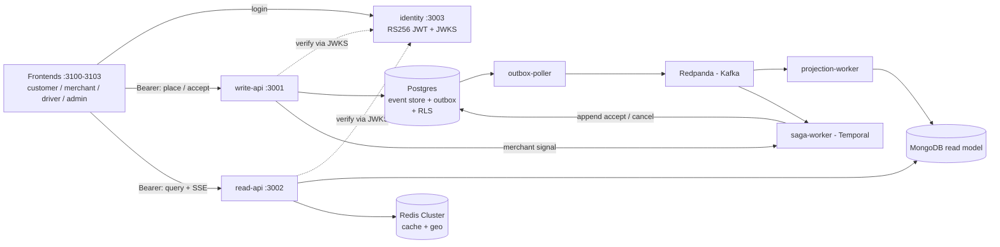
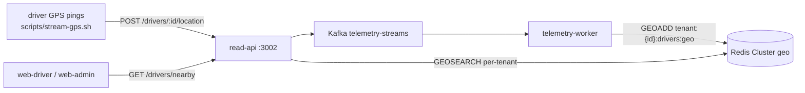

# FlashBite

A multi-tenant, hyper-local delivery platform built as a **distributed-systems
architecture showcase** — one order journey taken end-to-end through every serious
backend pattern, with a second tenant present purely to prove isolation.

> Portfolio / learning project. The value is depth: each pattern is built in
> "hard mode," and the whole thing runs locally end-to-end.

---

## What it demonstrates

A single order flows through **every box** in the architecture (CQRS: an event-sourced write
plane and a projected read plane, joined by Kafka):



Plus a real-time **telemetry plane** (ephemeral — Redis geo only, never persisted):



> **Full architecture (components, sequence diagrams, data model):**
> [`docs/ARCHITECTURE.md`](docs/ARCHITECTURE.md).

**Built (Phases 0–3d):**

- **CQRS + Event Sourcing + transactional outbox** — order events + outbox row in one Postgres tx; forward-only, rebuildable Mongo projections (`pnpm rebuild:projection` replays the store).
- **Order aggregate, ES hard mode** — `POST /orders` rehydrates the `Order` aggregate from its stream, enforces transition invariants, writes with optimistic concurrency (version check).
- **Avro on Kafka (Redpanda)** — Avro payloads + envelope metadata in Kafka headers, governed by a Schema Registry at BACKWARD compatibility (lookup-only producers); `tenantId:orderId` keys preserve ordering.
- **Temporal sagas + self-built payments** — one workflow per order: await confirm → authorize (`payments` :3004, own `flashbite_payments` DB) → SLA timer vs merchant approval → capture / void; deterministic decline → `PAYMENT_FAILED` → `OrderCancelled`.
- **Event-sourced driver dispatch + job UI** — on accept, the saga runs `driverDispatchWorkflow` as a child, offering the job to the nearest online + geolocated driver (re-offer on reject/timeout) via a separate `DriverDispatch` aggregate; the driver app goes online/offline and accepts → pickup → deliver over a per-driver SSE stream.
- **Delivery tracking** — live delivery line on the customer page (incl. driver-location map) + Delivery column on the merchant dashboard (snapshot + tenant-wide SSE); driver identity stripped server-side.
- **Verified-JWT tenancy + Postgres RLS** — `identity` issues RS256 tokens + JWKS; services derive `tenantId`/`role` from the verified token (no `X-Tenant-ID`); Row-Level Security on the write plane via a restricted `flashbite_app` role backstops app bugs.
- **Identity hardening** — access token in memory, bootstrapped from a rotating one-time-use httpOnly refresh cookie (per-app scoped; reuse revokes the family); persisted, rotatable RS256 key, envelope-encrypted at rest.
- **DB-backed tenant catalog** — `tenants` table is the runtime source of truth; cached `TenantCatalogService` + per-request `TenantGuard`; `GET /tenants`. Frontends are catalog-driven via `useTenants()` (per-tenant maps/city-centers from catalog metadata; no hardcoded tenant constants in web-shared).
- **Role-based access + operator console** — `@Roles` guard on the JWT `role`; an authenticated cross-tenant `/admin/*` API powers the admin dashboard.
- **Polyglot persistence + real-time telemetry** — Postgres (event store), Mongo (read models + inbox), Redis Cluster (cache + geo, `tenant:{id}` hash tags); ephemeral driver GPS into per-tenant Redis geo, served via `GEOSEARCH`.
- **Idempotency everywhere** — stable `eventId`, Mongo inbox dedup, Temporal `WorkflowId = tenantId:orderId`.
- **Four Next.js frontends** — customer, merchant (live SSE), driver (Mapbox), admin, on a shared design system, Bearer auth.

**Planned:** frontend polish + observability (Phase 4); real Stripe (refund / webhook / read-model) is backlogged. See `docs/superpowers/backlog.md`.

See the **current architecture** in [`docs/ARCHITECTURE.md`](docs/ARCHITECTURE.md), and the original
vision in
[`docs/superpowers/specs/2026-06-13-flashbite-showcase-design.md`](docs/superpowers/specs/2026-06-13-flashbite-showcase-design.md).

---

## Tech stack

NestJS · Next.js 16 · Kafka (Redpanda) · Confluent Schema Registry · Avro · Temporal · PostgreSQL +
Prisma (+ Row-Level Security) · MongoDB · Redis Cluster · `jose` (RS256 JWT / JWKS) · argon2 ·
recharts · react-map-gl · TypeScript · pnpm monorepo · Docker Compose.

## Monorepo layout

```
apps/        identity (JWT/JWKS), write-api, read-api, outbox-poller, projection-worker,
             saga-worker, telemetry-worker, payments (authorize/capture/void),
             web-customer, web-merchant, web-driver, web-admin
packages/    contracts (event types + envelope/key helpers + ROLES/TENANTS + .avsc schemas),
             messaging (Avro serde + Schema Registry client + header/publish/consume helpers
             + register script), shared (Prisma, Mongo, Redis, event-store, tenant-scoped tx),
             tenant-context (verify-JWT auth context + @Roles guard), web-shared (design system
             + client + auth store)
infra/       docker-compose.yml + runbook
spikes/      Phase 0 de-risking scripts (throwaway)
docs/        ARCHITECTURE.md, specs, per-phase plans, backlog
```

---

## Roadmap

The master spec decomposes the build into phases, each its own plan → implement cycle:

| Phase | Goal | Status |
|-------|------|--------|
| **0** | Infra up + de-risk Kafka / Temporal / outbox / Redis Cluster | ✅ complete |
| **1** | Walking skeleton end-to-end (CQRS/ES/outbox, projection, SSE, Temporal saga, telemetry) **+ all four frontends** | ✅ complete |
| **2** | Identity (verified JWT) + isolation hard mode (Postgres RLS) + operator console + frontend auth | ✅ complete |
| **3a** | Event-sourced Order aggregate (full ES, optimistic concurrency) | ✅ complete |
| **3b** | Avro + Schema Registry on the event bus | ✅ complete |
| **3c** | Self-built payments service (authorize/capture/void, PAYMENT_FAILED) | ✅ complete |
| **3d** | Driver dispatch (event-sourced, saga child workflow) + driver job UI (online + live offers over SSE) + customer live driver-location map (3d-iii) + delivery tracking on customer/merchant | ✅ complete |
| **4** | Frontend polish + observability story | ⬜ next (only phase left) |

Phase 1 was built in vertical slices: **1a** write path (event store + outbox), **1b** read path
(projection + Redis cache + SSE), **1c-i** Temporal order-lifecycle saga, **1c-ii** driver
telemetry (Redis geo + nearby), and **1d** the frontends — **1d-i** customer storefront,
**1d-ii** merchant dashboard, **1d-iii** driver view, **1d-iv** cross-tenant admin grid.

Phase 2 was built in slices: **2a** identity service (RS256 JWT + JWKS, seeded users), **S1**
verified-JWT tenant/role context replacing `X-Tenant-ID` on write-api + read-api (Bearer-required
hard cut), **S2** Postgres RLS on the write plane, **S3** the cross-tenant operator console API, and
**S4** frontend login (Bearer everywhere, admin via the operator endpoints).

---

## Getting started

Requires **Docker Desktop** and **pnpm**. Two commands take you from clone to a running stack:

```bash
pnpm install
pnpm bootstrap   # cold start (run once, or after `pnpm infra:nuke`): infra up (waits for
                 # Postgres + Redpanda health) -> DB migrate + Prisma client -> payments DB
                 # -> seed tenants/users/drivers -> register Avro schemas
pnpm dev         # start ALL 12 processes (8 services/workers + 4 frontends), labeled +
                 # color-coded in one terminal; one Ctrl-C stops them all
```

Narrower aggregates when you don't need the whole stack:

```bash
pnpm dev:services  # 8 backend services/workers (identity, write, read, payments, outbox,
                   # projection, saga, telemetry)
pnpm dev:web       # 4 Next.js frontends (customer, merchant, driver, admin)
```

> Docker infra stays up across code changes — only the `dev:*` processes need restarting (each
> transpiles at boot, so a stale process serves old code). `pnpm dev` makes that one command.

**Log in** with seeded credentials (`role@tenant.test` / `devpassword`): e.g. `customer@berlin.test`,
`merchant@berlin.test`, drivers `drv-1@berlin.test … drv-4@berlin.test` (the JWT `sub` is the dispatch
`driverId`), and `operator@flashbite.test` for the admin console. Every UI requires a logged-in user;
tenancy + role come from the **verified JWT** (`Authorization: Bearer`) — the old `X-Tenant-ID` header
is no longer accepted. Maps use a public `NEXT_PUBLIC_MAPBOX_TOKEN` (a fallback panel renders without one).

| Surface | URL | Surface | URL |
|---|---|---|---|
| Customer | <http://localhost:3100> | write-api | <http://localhost:3001> |
| Merchant | <http://localhost:3101> | read-api | <http://localhost:3002> |
| Driver | <http://localhost:3102> | payments | <http://localhost:3004> |
| Admin | <http://localhost:3103> | Temporal UI | <http://localhost:8080> |
| identity | <http://localhost:3003> | Redpanda Console | <http://localhost:8085> |

**Tests:** `pnpm test` (backend, needs infra up), `pnpm --filter @flashbite/web-shared test`
(frontend units), `pnpm test:e2e:<customer|merchant|driver|admin>` (Playwright, needs the relevant
services + identity up and users seeded).

**Key env vars** (full list in `.env.example`):

| Variable | Default / example | Purpose |
|---|---|---|
| `PAYMENTS_URL` | `http://localhost:3004` | Saga payments-client base URL |
| `PAYMENTS_DATABASE_URL` | `postgresql://flashbite:…@localhost:5434/flashbite_payments` | Prisma DSN for the payments service |
| `AUTH_DECLINE_THRESHOLD` | `100000` (pence) | Orders above this amount are deterministically declined (demo decline rule) |
| `SIGNING_KEY_KEK` | base64 32 bytes (`openssl rand -base64 32`) | KEK that envelope-encrypts the signing key at rest; **required in production** |

> **macOS note:** Redis runs as a single-container `grokzen/redis-cluster` (6-node) on ports
> 7100–7105 — Docker Desktop for Mac can't expose discrete cluster nodes to the host. Logically
> still a 6-node cluster; production would use discrete nodes.

<details>
<summary>Manual / per-service equivalents (what <code>bootstrap</code> and <code>dev</code> run)</summary>

```bash
pnpm infra:up           # Postgres, Mongo, Redpanda (+Schema Registry :18081), Temporal, Redis Cluster
pnpm db:setup           # migrate event store/outbox/users (+ flashbite_app RLS role), generate
                        # Prisma client, seed tenants + users
pnpm payments:setup     # create + migrate flashbite_payments DB, generate its Prisma client
pnpm seed:drivers       # (re)seed driver accounts drv-1..drv-4@<tenant>.test
pnpm register:schemas   # register Avro schemas at BACKWARD compatibility (lookup-only producers)

# order plane                            # frontends (proxy /api/{identity,read,write})
pnpm dev:write-api    # :3001            pnpm dev:identity      # :3003  login + JWKS (required)
pnpm dev:read-api     # :3002            pnpm dev:web-customer  # :3100
pnpm dev:outbox       # outbox -> Kafka  pnpm dev:web-merchant  # :3101
pnpm dev:projection   # Kafka -> Mongo   pnpm dev:web-driver    # :3102  (NEXT_PUBLIC_MAPBOX_TOKEN)
pnpm dev:saga         # Temporal         pnpm dev:web-admin     # :3103
pnpm dev:payments     # :3004
pnpm dev:telemetry    # telemetry -> Redis geo
```

> **RLS:** `db:setup` creates the restricted `flashbite_app` Postgres role; write-api + saga-worker
> connect as it via `APP_DATABASE_URL` so Row-Level Security enforces tenant isolation on
> `event_store`/`outbox`. The outbox-poller stays on the superuser `DATABASE_URL` (it relays every tenant).
</details>

<details>
<summary>Phase 0 de-risking spikes (throwaway proofs that each technology works in isolation)</summary>

```bash
pnpm --filter @flashbite/spikes kafka            # partition-key ordering
pnpm --filter @flashbite/spikes temporal:worker  # (terminal 1) leave running
pnpm --filter @flashbite/spikes temporal:run     # (terminal 2) SLA race
pnpm --filter @flashbite/spikes outbox           # outbox round-trip
pnpm --filter @flashbite/spikes redis            # cluster + tenant hash tags
```

Full infra runbook: [`infra/README.md`](infra/README.md).
</details>

---

## Driver telemetry

Ephemeral driver locations stream into Redis geo and are queryable per tenant. With the stack
running (`pnpm dev`, or at least `dev:identity` + `dev:read-api` + `dev:telemetry`):

```bash
# stream simulated GPS pings (random walk) until Ctrl+C — logs in for a driver JWT first
./scripts/stream-gps.sh
# tune: DRIVER=drv-2 TENANT=tokyo INTERVAL=0.5 ./scripts/stream-gps.sh   # drivers seeded drv-1..drv-4

# …or by hand (tenant comes from the token, not a header):
TOKEN=$(curl -s -XPOST localhost:3003/auth/login -H 'Content-Type: application/json' \
  -d '{"email":"drv-1@berlin.test","password":"devpassword"}' \
  | sed -n 's/.*"accessToken":"\([^"]*\)".*/\1/p')
curl -XPOST localhost:3002/drivers/drv-1/location \
  -H 'Content-Type: application/json' -H "Authorization: Bearer $TOKEN" \
  -d '{"lng":13.405,"lat":52.52}'                         # → 202
curl "localhost:3002/drivers/nearby?lng=13.405&lat=52.52&radiusKm=5" \
  -H "Authorization: Bearer $TOKEN"                       # → nearby drivers (tenant from token)
```

Telemetry is **ephemeral** — Redis geospatial only, never Postgres / the event store.
Per-tenant isolation holds on both write and read (`tenant:{id}:drivers:geo`), scoped by the
token's tenant. Manual requests live in [`apps/write-api/requests.http`](apps/write-api/requests.http); see
[`docs/superpowers/plans/phase-1c-ii-verification.md`](docs/superpowers/plans/phase-1c-ii-verification.md).

---

## Schema evolution & deployment (Phase 3b)

Kafka messages are **Confluent-Avro**: the value is the event payload, envelope metadata
(`eventType`/`tenantId`/`eventId`/`version`/`occurredAt`) rides in **Kafka headers**, and each message
carries its **writer schema id** so consumers always decode with the schema the message was written
with. Schemas are governed in the Schema Registry (`localhost:18081`), registered explicitly by
`pnpm register:schemas` at **BACKWARD** compatibility; producers are **lookup-only** and never
auto-register.

To evolve a schema without breaking the live bus, follow these rules.

**1. Only make compatible changes.** Under BACKWARD, you may **add an optional field with a default**
or **remove a field** — nothing else. `pnpm register:schemas` runs the compatibility check and **fails
if the change is breaking** (e.g. a new required field with no default), so CI catches it before it
ships. Adding a required field without a default is not allowed.

**2. Deploy order follows the compatibility mode.** BACKWARD means *a new schema can read old data*,
so roll out **consumers before producers**:

| Mode | Guarantee | Safe deploy order |
|---|---|---|
| **BACKWARD** (current) | new schema reads old data | **consumers first, then producers** |
| FORWARD | old schema reads new data | producers first, then consumers |
| FULL / FULL_TRANSITIVE | both directions | **any order** (most foolproof) |

If you'd rather not reason about order, raise the subjects to `FULL_TRANSITIVE` in
`packages/messaging/src/register.ts` — then any allowed change is safe in any direction and is
checked against *every* prior version.

**3. Restart producers to emit the new schema.** Producers cache the resolved schema id for the
process lifetime (`resolveSchemaId`), so a running producer keeps emitting the old version until it
**restarts**. This is safe under BACKWARD (consumers still read old data), but if you expect the new
version on the wire, redeploy the producers.

**4. Keep handlers tolerant of field drift.** The registry guarantees a message is *decodable*, not
that your logic copes. A new field is ignored by old handlers; a removed field reads as `undefined`.
Read optional fields defensively (`?.` / `??`) in `applyEvent` / `applyTelemetry` / `toStreamEvent`.

> **Note:** Avro governs only the Kafka *transport*. The durable source of truth is the **JSON
> `event_store` in Postgres**, and `pnpm rebuild:projection` replays it straight through `applyEvent`
> (bypassing Kafka/Avro). So historical events with older payload shapes hit your newest handler code
> on every rebuild — handler tolerance of old shapes matters there regardless of the Avro schema.

**Change workflow:**

```bash
# 1. edit the schema (additive: new field with a `default`)
#    packages/contracts/avro/<event>.avsc   + the matching TS payload type in contracts
# 2. register — the BACKWARD check rejects a breaking change locally / in CI
pnpm register:schemas
# 3. update producer/handler code
# 4. deploy consumers first, then producers   (BACKWARD)
# 5. restart producers so they pick up the new latest schema id
```
