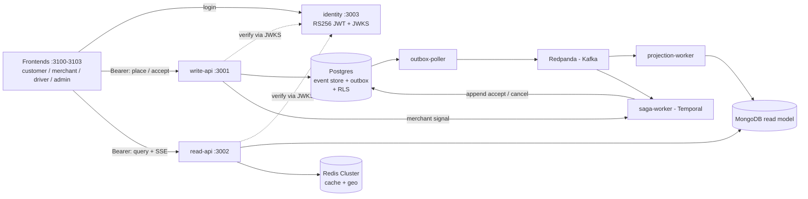
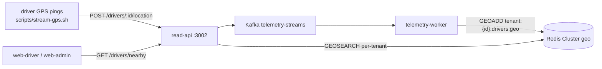

# FlashBite

A multi-tenant, hyper-local delivery platform built as a **distributed-systems
architecture showcase** — one order journey taken end-to-end through every serious
backend pattern, with a second tenant present purely to prove isolation.

> Portfolio / learning project. The value is depth: each pattern is built in
> "hard mode," and the whole thing runs locally end-to-end.

---

## What it demonstrates

A single order flows through **every box** in the architecture (CQRS: an event-sourced write
plane and a projected read plane, joined by Kafka):



Plus a real-time **telemetry plane** (ephemeral — Redis geo only, never persisted):



> **Full architecture (components, sequence diagrams, data model):**
> [`docs/ARCHITECTURE.md`](docs/ARCHITECTURE.md).

**Built (Phase 0 + 1 + 2 + 3a/3b/3c/3d):**

- **CQRS + Event Sourcing + Transactional Outbox** — order events + outbox row committed in one
  Postgres transaction (Prisma); forward-only, rebuildable Mongo projections.
- **Order aggregate + ES hard mode (Phase 3a)** — `POST /orders` rehydrates the `Order` aggregate
  from its event stream, enforces transition invariants, and writes with optimistic concurrency
  (version check), replacing the prior blind-append approach. `pnpm rebuild:projection` replays
  the full event store into the Mongo read model (ES rebuildability demonstrated end-to-end).
- **Kafka (via Redpanda) — Confluent-Avro (Phase 3b)** — messages carry **Avro-encoded payloads**
  (value) with envelope metadata (eventId, tenantId, eventType, …) in **Kafka headers**. Schemas
  are governed by the **Schema Registry** at `localhost:18081`, registered via `pnpm
  register:schemas` (BACKWARD compatibility enforced; producers are lookup-only, never auto-
  register). Per-order partition keys (`tenantId:orderId`) preserve ordering.
- **Temporal sagas + payments service (Phase 3c)** — one workflow per order: **authorize** payment (via the `payments` service :3004) → per-tenant SLA timer raced against the merchant-approval signal → **capture** (accept) or **void** (decline / SLA breach). A deterministic decline rule (`AUTH_DECLINE_THRESHOLD`, default 100 000) produces `PAYMENT_FAILED` → `OrderCancelled`. The payments service owns its own `flashbite_payments` database (Postgres, separate bounded context).
- **Driver dispatch + job UI (Phase 3d)** — after an order is accepted, the saga `executeChild`s a
  `driverDispatchWorkflow` that offers the job to the nearest **online + geolocated** driver, re-offering
  the next-nearest on reject/timeout; a second event-sourced `DriverDispatch` aggregate (own
  `dispatch-events` topic + read model) keeps the bounded context separate at the data layer. The driver
  app goes online/offline and receives offers over a **per-driver-filtered SSE stream**
  (`GET /driver/dispatch/stream`), accepting → pickup → deliver; `driverId` is the JWT `sub` (drivers
  seeded `drv-1..drv-4`, so identity == dispatch id).
- **Delivery tracking for customer + merchant (Phase 3d-iv)** — the customer order page shows a live
  delivery line (Finding a driver → Driver assigned → Out for delivery → Delivered), and the merchant
  dashboard shows a live **Delivery** column + detail line (seeded from a `GET /merchant/dispatch`
  snapshot, then a tenant-wide dispatch SSE). Outward-facing labels; driver identity is stripped
  server-side so it never reaches the customer/merchant wire.
- **Polyglot persistence** — Postgres (event store), Mongo (read models + inbox), Redis Cluster
  (cache + geo, `tenant:{id}` hash-tag co-location).
- **Real-time telemetry** — ephemeral driver GPS (`DriverTelemetryStreamed` on `telemetry-streams`)
  into per-tenant Redis geo indices, served via `GEOSEARCH` (`GET /drivers/nearby`); never
  persisted.
- **Idempotency & dedup** — at every hop: stable `eventId`, Mongo inbox pattern, Temporal
  `WorkflowId = tenantId:orderId` reject-duplicate reuse policy.
- **Identity & verified-JWT tenancy (Phase 2)** — a dedicated `identity` service issues **RS256**
  access tokens and publishes a **JWKS** endpoint; write-api/read-api verify the token (signature +
  `iss`/`aud`/`exp`) and derive `tenantId` + `role` from it. The trusted `X-Tenant-ID` header is
  **gone** — isolation rests on cryptographic identity, not a client-supplied header.
- **Identity hardening** — short-lived access tokens kept **in memory** (not localStorage) and bootstrapped on load from a rotating, one-time-use **httpOnly refresh-token cookie** (scoped per app so local frontends don't collide); reuse of a rotated token revokes the whole family; persisted + rotatable RS256 signing key.
- **Postgres Row-Level Security (Phase 2)** — the write plane (`event_store` + `outbox`) is RLS-
  enforced: write-api + saga-worker connect as a restricted, non-superuser `flashbite_app` role and
  set `app.tenant_id` per transaction, so a tenant can never read or write another's rows even if
  app code has a bug. The outbox-poller stays privileged (it relays every tenant).
- **Role-based access + operator console (Phase 2)** — JWT `role` claim (`customer` / `merchant` /
  `driver` / `admin` / `operator`) gated by a `@Roles` guard; an authenticated **cross-tenant
  operator API** (`/admin/orders`, `/admin/drivers`, merged `/admin/orders/stream`) powers the admin
  dashboard.
- **Four Next.js frontends** — customer, merchant (live SSE), driver (Mapbox), admin (operator
  console), on a shared design system, with a minimal login (seeded users) sending `Authorization:
  Bearer`.
- **Multi-tenancy** — `tenantId` threaded through every tier (Kafka keys, Mongo ids, Redis hash
  tags) and now **resolved from the verified JWT**, backstopped by Postgres RLS on the write plane.

**Planned (later phases):** real Stripe integration (refund / webhook settlement / payment read model). Server-deriving the dispatch `driverId` from the JWT `sub` is backlogged. See `docs/superpowers/backlog.md`.

See the **current architecture** in [`docs/ARCHITECTURE.md`](docs/ARCHITECTURE.md), and the original
vision in
[`docs/superpowers/specs/2026-06-13-flashbite-showcase-design.md`](docs/superpowers/specs/2026-06-13-flashbite-showcase-design.md).

---

## Tech stack

NestJS · Next.js 16 · Kafka (Redpanda) · Confluent Schema Registry · Avro · Temporal · PostgreSQL +
Prisma (+ Row-Level Security) · MongoDB · Redis Cluster · `jose` (RS256 JWT / JWKS) · argon2 ·
recharts · react-map-gl · TypeScript · pnpm monorepo · Docker Compose.

## Monorepo layout

```
apps/        identity (JWT/JWKS), write-api, read-api, outbox-poller, projection-worker,
             saga-worker, telemetry-worker, payments (authorize/capture/void),
             web-customer, web-merchant, web-driver, web-admin
packages/    contracts (event types + envelope/key helpers + ROLES/TENANTS + .avsc schemas),
             messaging (Avro serde + Schema Registry client + header/publish/consume helpers
             + register script), shared (Prisma, Mongo, Redis, event-store, tenant-scoped tx),
             tenant-context (verify-JWT auth context + @Roles guard), web-shared (design system
             + client + auth store)
infra/       docker-compose.yml + runbook
spikes/      Phase 0 de-risking scripts (throwaway)
docs/        ARCHITECTURE.md, specs, per-phase plans, backlog
```

---

## Roadmap

The master spec decomposes the build into phases, each its own plan → implement cycle:

| Phase | Goal | Status |
|-------|------|--------|
| **0** | Infra up + de-risk Kafka / Temporal / outbox / Redis Cluster | ✅ complete |
| **1** | Walking skeleton end-to-end (CQRS/ES/outbox, projection, SSE, Temporal saga, telemetry) **+ all four frontends** | ✅ complete |
| **2** | Identity (verified JWT) + isolation hard mode (Postgres RLS) + operator console + frontend auth | ✅ complete |
| **3a** | Event-sourced Order aggregate (full ES, optimistic concurrency) | ✅ complete |
| **3b** | Avro + Schema Registry on the event bus | ✅ complete |
| **3c** | Self-built payments service (authorize/capture/void, PAYMENT_FAILED) | ✅ complete |
| **3d** | Driver dispatch (event-sourced, saga child workflow) + driver job UI (online + live offers over SSE) + delivery tracking on customer/merchant | ✅ complete |
| 3 (remaining) | Customer live driver-location tracking (3d-iii), real Stripe (refund/webhook/read-model) | planned |
| 4 | Frontend polish + observability story | planned |

Phase 1 was built in vertical slices: **1a** write path (event store + outbox), **1b** read path
(projection + Redis cache + SSE), **1c-i** Temporal order-lifecycle saga, **1c-ii** driver
telemetry (Redis geo + nearby), and **1d** the frontends — **1d-i** customer storefront,
**1d-ii** merchant dashboard, **1d-iii** driver view, **1d-iv** cross-tenant admin grid.

Phase 2 was built in slices: **2a** identity service (RS256 JWT + JWKS, seeded users), **S1**
verified-JWT tenant/role context replacing `X-Tenant-ID` on write-api + read-api (Bearer-required
hard cut), **S2** Postgres RLS on the write plane, **S3** the cross-tenant operator console API, and
**S4** frontend login (Bearer everywhere, admin via the operator endpoints).

---

## Quickstart (Phase 0)

Requires Docker Desktop and pnpm.

```bash
pnpm install
pnpm infra:up          # Postgres, Mongo, Redpanda (+Console), Temporal, Redis Cluster
pnpm infra:ps          # confirm health
```

Run the de-risking spikes (proof each technology works in isolation):

```bash
pnpm --filter @flashbite/spikes kafka            # partition-key ordering
pnpm --filter @flashbite/spikes temporal:worker  # (terminal 1) leave running
pnpm --filter @flashbite/spikes temporal:run     # (terminal 2) SLA race
pnpm --filter @flashbite/spikes outbox           # outbox round-trip
pnpm --filter @flashbite/spikes redis            # cluster + tenant hash tags
```

Observability UIs: Temporal at <http://localhost:8080>, Redpanda Console at
<http://localhost:8085>. Full runbook: [`infra/README.md`](infra/README.md).

> **macOS note:** Redis runs as a single-container `grokzen/redis-cluster` (6-node)
> on ports 7100–7105 — Docker Desktop for Mac can't expose discrete cluster nodes to the
> host. Logically still a 6-node cluster; production would use discrete nodes.

---

## Run the full app (Phase 1 + 2)

Bring up infra, then the order pipeline and whichever frontend(s) you want — each in its own
terminal (or background them):

```bash
pnpm infra:up          # Postgres, Mongo, Redpanda (+Schema Registry :18081), Temporal, Redis Cluster
pnpm db:deploy         # apply Prisma migrations (event store, outbox, users)
pnpm payments:generate # (Phase 3c) generate Prisma client for flashbite_payments DB
pnpm payments:db:create # (Phase 3c, one-time on existing volumes) create flashbite_payments DB
pnpm payments:db:deploy # (Phase 3c) apply payments DB migrations
pnpm seed:users        # (Phase 2a) seed demo users — role@tenant.test / devpassword (incl. drivers)
pnpm seed:drivers      # (Phase 3d) re-seed just the driver accounts (drv-1..drv-4@<tenant>.test)
pnpm register:schemas  # (Phase 3b, one-time) register Avro schemas with BACKWARD compatibility
```

> Phase 2 RLS: `pnpm db:deploy` also creates the restricted `flashbite_app` Postgres role.
> write-api + saga-worker connect as it via `APP_DATABASE_URL` so Row-Level Security enforces
> tenant isolation on `event_store`/`outbox`; the outbox-poller stays on the superuser
> `DATABASE_URL` (it relays every tenant's events).

```bash

# order plane
pnpm dev:write-api     # :3001  place orders, relay merchant accept/decline
pnpm dev:read-api      # :3002  queries, SSE, telemetry ingest + nearby
pnpm dev:outbox        # outbox  -> Kafka
pnpm dev:projection    # Kafka   -> Mongo read model
pnpm dev:saga          # Temporal order-lifecycle workflow (authorize → capture/void)
pnpm dev:payments      # :3004  payments service (authorize / capture / void)
pnpm dev:telemetry     # Kafka telemetry-streams -> Redis geo

# frontends (each proxies /api/identity -> :3003, /api/read -> :3002, /api/write -> :3001)
pnpm dev:identity      # :3003  JWT identity service — MUST be running for login
pnpm dev:web-customer  # :3100  storefront + order tracking
pnpm dev:web-merchant  # :3101  live order queue, accept/decline
pnpm dev:web-driver    # :3102  driver job UI (online toggle + live dispatch offers) + nearby map (NEXT_PUBLIC_MAPBOX_TOKEN for tiles)
pnpm dev:web-admin     # :3103  cross-tenant GMV/analytics + driver maps
```

> **Login required (Phase 2 S4):** after `pnpm seed:users`, every UI requires a logged-in user.
> Use seeded credentials (`role@tenant.test` / `devpassword`), e.g. `customer@berlin.test`,
> `merchant@berlin.test`; drivers are seeded `drv-1@berlin.test … drv-4@berlin.test` (the JWT `sub`
> is the dispatch `driverId`); the admin dashboard uses `operator@flashbite.test`.
> `pnpm dev:identity` must be running — each frontend reaches it same-origin via the
> `/api/identity/*` Next.js rewrite.

| Surface | URL | Surface | URL |
|---|---|---|---|
| Customer | <http://localhost:3100> | write-api | <http://localhost:3001> |
| Merchant | <http://localhost:3101> | read-api | <http://localhost:3002> |
| Driver | <http://localhost:3102> | payments | <http://localhost:3004> |
| Admin | <http://localhost:3103> | Temporal UI | <http://localhost:8080> |
| identity | <http://localhost:3003> | Redpanda Console | <http://localhost:8085> |

**New env vars (Phase 3c):**

| Variable | Default / example | Purpose |
|---|---|---|
| `PAYMENTS_URL` | `http://localhost:3004` | Saga payments-client base URL |
| `PAYMENTS_DATABASE_URL` | `postgresql://flashbite:…@localhost:5434/flashbite_payments` | Prisma DSN for the payments service |
| `AUTH_DECLINE_THRESHOLD` | `100000` (pence) | Orders above this amount are deterministically declined (demo decline rule) |

Tenancy + role come from the **verified JWT** (`Authorization: Bearer`) — the frontends obtain it at
login and send it for you; the old `X-Tenant-ID` header is no longer accepted. Maps use a public
`NEXT_PUBLIC_MAPBOX_TOKEN` (a fallback panel renders without one). **Tests:** `pnpm test`
(backend, needs infra up), `pnpm --filter @flashbite/web-shared test` (frontend units), and
`pnpm test:e2e:<customer|merchant|driver|admin>` (Playwright, needs the relevant services + identity
up, users seeded).

---

## Driver telemetry (Phase 1c-ii)

Ephemeral driver locations stream into Redis geo and are queryable per tenant:

```bash
pnpm infra:up
pnpm dev:identity      # http://localhost:3003 (login + JWKS) — needed for a token
pnpm dev:read-api      # http://localhost:3002 (location ingest + nearby query)
pnpm dev:telemetry     # telemetry-streams → Redis geo
pnpm seed:users        # role@tenant.test / devpassword

# stream simulated GPS pings (random walk) until Ctrl+C — logs in for a driver JWT first
./scripts/stream-gps.sh
# tune: DRIVER=drv-2 TENANT=tokyo INTERVAL=0.5 ./scripts/stream-gps.sh   # drivers seeded drv-1..drv-4

# …or by hand (tenant comes from the token, not a header):
TOKEN=$(curl -s -XPOST localhost:3003/auth/login -H 'Content-Type: application/json' \
  -d '{"email":"drv-1@berlin.test","password":"devpassword"}' \
  | sed -n 's/.*"accessToken":"\([^"]*\)".*/\1/p')
curl -XPOST localhost:3002/drivers/drv-1/location \
  -H 'Content-Type: application/json' -H "Authorization: Bearer $TOKEN" \
  -d '{"lng":13.405,"lat":52.52}'                         # → 202
curl "localhost:3002/drivers/nearby?lng=13.405&lat=52.52&radiusKm=5" \
  -H "Authorization: Bearer $TOKEN"                       # → nearby drivers (tenant from token)
```

Telemetry is **ephemeral** — Redis geospatial only, never Postgres / the event store.
Per-tenant isolation holds on both write and read (`tenant:{id}:drivers:geo`), scoped by the
token's tenant. Manual requests live in [`apps/write-api/requests.http`](apps/write-api/requests.http); see
[`docs/superpowers/plans/phase-1c-ii-verification.md`](docs/superpowers/plans/phase-1c-ii-verification.md).

---

## Schema evolution & deployment (Phase 3b)

Kafka messages are **Confluent-Avro**: the value is the event payload, envelope metadata
(`eventType`/`tenantId`/`eventId`/`version`/`occurredAt`) rides in **Kafka headers**, and each message
carries its **writer schema id** so consumers always decode with the schema the message was written
with. Schemas are governed in the Schema Registry (`localhost:18081`), registered explicitly by
`pnpm register:schemas` at **BACKWARD** compatibility; producers are **lookup-only** and never
auto-register.

To evolve a schema without breaking the live bus, follow these rules.

**1. Only make compatible changes.** Under BACKWARD, you may **add an optional field with a default**
or **remove a field** — nothing else. `pnpm register:schemas` runs the compatibility check and **fails
if the change is breaking** (e.g. a new required field with no default), so CI catches it before it
ships. Adding a required field without a default is not allowed.

**2. Deploy order follows the compatibility mode.** BACKWARD means *a new schema can read old data*,
so roll out **consumers before producers**:

| Mode | Guarantee | Safe deploy order |
|---|---|---|
| **BACKWARD** (current) | new schema reads old data | **consumers first, then producers** |
| FORWARD | old schema reads new data | producers first, then consumers |
| FULL / FULL_TRANSITIVE | both directions | **any order** (most foolproof) |

If you'd rather not reason about order, raise the subjects to `FULL_TRANSITIVE` in
`packages/messaging/src/register.ts` — then any allowed change is safe in any direction and is
checked against *every* prior version.

**3. Restart producers to emit the new schema.** Producers cache the resolved schema id for the
process lifetime (`resolveSchemaId`), so a running producer keeps emitting the old version until it
**restarts**. This is safe under BACKWARD (consumers still read old data), but if you expect the new
version on the wire, redeploy the producers.

**4. Keep handlers tolerant of field drift.** The registry guarantees a message is *decodable*, not
that your logic copes. A new field is ignored by old handlers; a removed field reads as `undefined`.
Read optional fields defensively (`?.` / `??`) in `applyEvent` / `applyTelemetry` / `toStreamEvent`.

> **Note:** Avro governs only the Kafka *transport*. The durable source of truth is the **JSON
> `event_store` in Postgres**, and `pnpm rebuild:projection` replays it straight through `applyEvent`
> (bypassing Kafka/Avro). So historical events with older payload shapes hit your newest handler code
> on every rebuild — handler tolerance of old shapes matters there regardless of the Avro schema.

**Change workflow:**

```bash
# 1. edit the schema (additive: new field with a `default`)
#    packages/contracts/avro/<event>.avsc   + the matching TS payload type in contracts
# 2. register — the BACKWARD check rejects a breaking change locally / in CI
pnpm register:schemas
# 3. update producer/handler code
# 4. deploy consumers first, then producers   (BACKWARD)
# 5. restart producers so they pick up the new latest schema id
```
