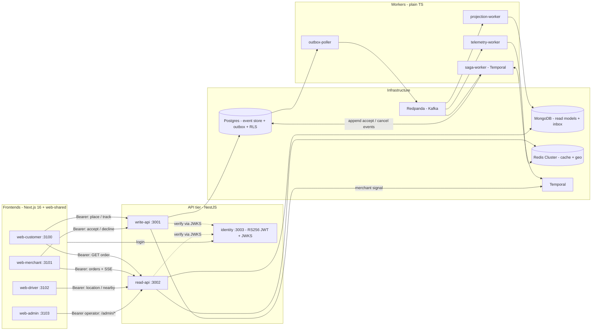
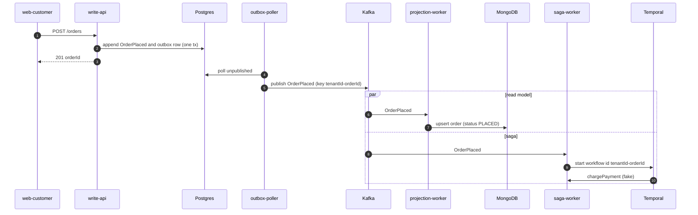
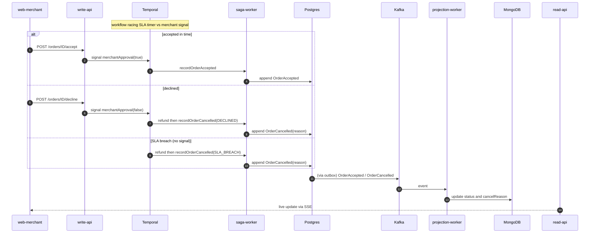
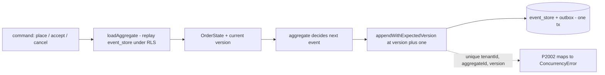
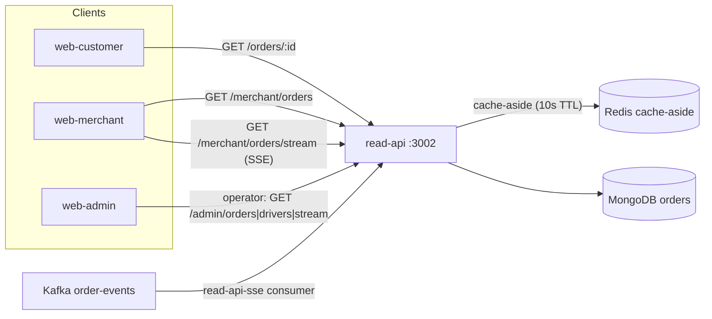
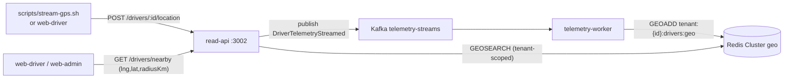
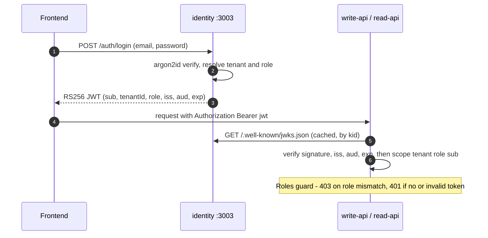
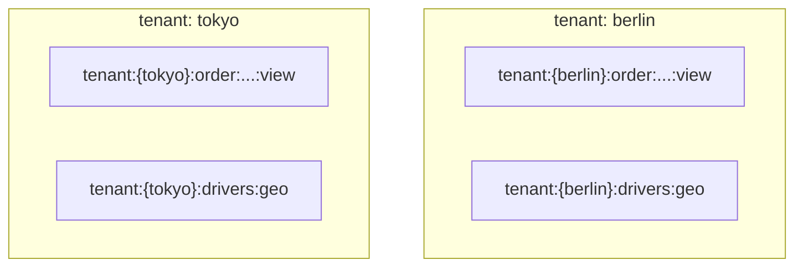

# FlashBite — Architecture (what's built so far)

This document describes the system **as currently implemented** (Phase 0 + Phase 1 + Phase 2 +
Phase 3a: the walking-skeleton order plane, the telemetry plane, all four frontends, the verified-JWT
identity + Postgres-RLS isolation layer, and the event-sourced Order aggregate with optimistic
concurrency). It is deliberately scoped to working code — a "Not yet built" section at the end lists
what the master spec still defers to later phases.

> Companion to the vision spec in
> [`docs/superpowers/specs/2026-06-13-flashbite-showcase-design.md`](superpowers/specs/2026-06-13-flashbite-showcase-design.md).
> Where the two disagree, **this document reflects the code**.

---

## 1. System overview

FlashBite is a pnpm monorepo of NestJS services, plain-TS workers, and Next.js frontends, over
Postgres / MongoDB / Redis Cluster / Redpanda (Kafka) / Temporal. It is **CQRS**: a write plane
(event-sourced) and a read plane (projected), joined by Kafka. Every API request carries a
**verified RS256 JWT** (from the `identity` service); tenant + role come from the token, not a
trusted header.

**Two independent planes:**

- **Order plane** (durable, event-sourced): everything from placing an order to its terminal
  status. Backed by Postgres (source of truth) + Mongo (read model).
- **Telemetry plane** (ephemeral): driver GPS pings into a Redis geo index. Never persisted to
  Postgres; not part of the order aggregate.

They are intentionally **disconnected today** — no backend assigns a driver to an order (that
"driver dispatch" loop is backlogged).

---

## 2. Components

| Component | Type | Port | Responsibility |
|---|---|---|---|
| `identity` | NestJS | 3003 | Authenticate seeded users (argon2id); issue short-lived **RS256** access tokens; publish public keys at `GET /.well-known/jwks.json`. Holds no sessions. |
| `write-api` | NestJS | 3001 | Verify the Bearer JWT (tenant + role); place orders by rehydrating the Order aggregate and appending `OrderPlaced` at the expected version (event + outbox, atomically, under RLS); relay merchant accept/decline as a Temporal signal. `@Roles` gates: `customer` places, `merchant` accepts/declines. |
| `read-api` | NestJS | 3002 | Verify the Bearer JWT; query orders (Mongo + Redis cache-aside); merchant SSE stream; telemetry ingest + `GET /drivers/nearby`; the operator-only cross-tenant `/admin/*` console. |
| `outbox-poller` | TS worker | — | Polls the Postgres outbox and publishes envelopes to Kafka (`order-events`). At-least-once. |
| `projection-worker` | TS worker | — | Consumes `order-events`, dedupes via a Mongo inbox, upserts the `orders` read model (version-guarded). |
| `saga-worker` | TS worker + Temporal | — | One workflow per order: charge → race SLA timer vs merchant approval → accept, or refund + cancel. Its accept/cancel activities drive the same Order aggregate (state-machine guarded, expected-version append). |
| `telemetry-worker` | TS worker | — | Consumes `telemetry-streams`, `GEOADD`s drivers into the per-tenant Redis geo key. |
| `web-customer` | Next.js | 3100 | Storefront: menu, cart, checkout, live order tracking. |
| `web-merchant` | Next.js | 3101 | Order queue (live SSE), accept/decline. |
| `web-driver` | Next.js | 3102 | Go online, view nearby drivers on a Mapbox map (GPS streamed by a script). |
| `web-admin` | Next.js | 3103 | Operator console (logs in as `operator@flashbite.test`): cross-tenant GMV/analytics charts, per-tenant driver maps, combined orders — served by the `/admin/*` endpoints. |

**Shared packages:** `contracts` (event types, status/reason enums, `ROLES`/`TENANTS`/`CITY_CENTERS`,
topic + key helpers, `OrderView`), `shared` (Prisma client + optional restricted-role URL,
`withTenantTransaction` for the RLS GUC, the pure `Order` aggregate + `aggregate-store`
load/append-with-expected-version, Mongo + Redis clients, JSON envelope builder), `tenant-context`
(verify-JWT `TokenVerifier` + `AuthMiddleware` →
AsyncLocalStorage `{tenantId, role, sub}`, `@Roles`/`RolesGuard`), `web-shared` (design system, API
client, auth store + `AuthGate`/`LoginForm`, stores, SSE hook, geo + analytics helpers).

---

## 3. Order lifecycle (write -> project -> saga)

Placing an order writes one event atomically with an outbox row; the outbox poller publishes it;
two consumers react independently — the projection updates the read model, the saga drives the
business workflow.

Then the workflow waits, racing a per-tenant SLA timer against the merchant's decision:

**Order status:** `PLACED -> ACCEPTED` or `PLACED -> CANCELLED` (`cancelReason` =
`SLA_BREACH` | `DECLINED`). The `web-customer` tracking page polls `GET /orders/:id`; the
`web-merchant` and `web-admin` views update live over SSE.

### Event-sourced write model (Phase 3a)

Both write paths — placing an order (write-api) and the saga's accept/cancel — go through a single
event-sourced aggregate instead of appending events ad hoc. Every write is **rehydrate → decide →
append-at-expected-version**:

- **Pure aggregate** (`@flashbite/shared` `order-aggregate.ts`): `foldOrder` replays an event list
  into the current `OrderState`; the commands `place` / `accept` / `cancel` decide the next event from
  that state and reject illegal transitions with `InvalidTransitionError` (e.g. accepting an
  already-terminal order). No I/O — a function of (state, command), trivially unit-tested.
- **Rehydrate-decide-append** (`aggregate-store.ts`): `loadAggregate` replays a tenant's `event_store`
  rows (under the `withTenantTransaction` RLS GUC) to rebuild state + current version;
  `appendWithExpectedVersion` writes the new event at `expectedVersion + 1` together with its outbox
  row in one transaction. A unique constraint on `(tenantId, aggregateId, version)` enforces
  **optimistic concurrency** — a concurrent writer at the same version trips Prisma `P2002`, surfaced
  as `ConcurrencyError`.
- **Conflict handling:** write-api treats `ConcurrencyError` on place as idempotent (the order already
  exists → return it). The saga lets it propagate so Temporal retries the activity; an
  `InvalidTransitionError` there is a benign no-op (the order already reached a terminal state — e.g.
  the SLA-timer-vs-accept race loser), so no second terminal event is ever appended.
- **Projection rebuild:** because `event_store` is the source of truth, the read model is disposable.
  `pnpm rebuild:projection` clears the Mongo `orders` collection + the inbox and replays every
  `event_store` event through the same `applyEvent` projection logic — deterministic and idempotent
  (re-running yields the same read model).

### Why it's "hard mode"

- **Transactional outbox:** the event and its outbox row commit in one Postgres transaction, so a
  crash can never publish an event that wasn't persisted (or vice versa).
- **Idempotency at every hop:** stable `eventId`; the projection's Mongo **inbox** skips
  re-delivered events; the saga starts workflows with `WorkflowId = tenantId:orderId` and a
  reject-duplicate reuse policy, so a re-delivered `OrderPlaced` can't double-charge.
- **Optimistic concurrency on the write side:** every event is appended at an expected aggregate
  version behind a `(tenantId, aggregateId, version)` unique constraint, so two concurrent writers
  for the same order can't both win — the loser gets a `ConcurrencyError`.
- **Version-guarded projection:** the read model only moves forward (`existing.version < event.version`).
- **Saga compensation:** a decline or SLA breach triggers a refund activity before recording the
  cancellation — the textbook saga compensation shape (payment is a fake activity today).

---

## 4. Read plane (CQRS query side)

- **Cache-aside:** `GET /orders/:id` checks Redis (`tenant:{id}:order:<id>:view`, 10s TTL) before
  Mongo. Every tenant-scoped read derives the tenant from the JWT via the `tenant-scope` chokepoint
  (`scopedId`/`tenantFilter`/`scopedKey`) — a query can't forget the tenant filter.
- **SSE:** read-api runs its own Kafka consumer (`read-api-sse` group) and pushes per-tenant order
  events to subscribers; the merchant dashboard consumes its tenant's stream, the operator console a
  merged all-tenant stream. The frontend derives the real status from the event type (the wire event
  also carries `cancelReason` on cancel).
- **Operator console:** `web-admin` authenticates as an `operator` and calls the **cross-tenant**
  `GET /admin/orders` (all tenants), `GET /admin/drivers` (loops tenants, GEOSEARCH per city
  center), and `GET /admin/orders/stream` (merged SSE, each event tagged with `tenantId`). These are
  the only routes that bypass tenant scoping, gated by `@Roles("operator")`; they read Mongo + Redis
  only (no Postgres). Aggregation (GMV, charts) stays client-side.

---

## 5. Telemetry plane (ephemeral geo)

Driver GPS is **simulated** (random-walk via `scripts/stream-gps.sh`, or the in-app emitter was
replaced by the script in 1d-iii). Ingest returns `202` and is fire-and-forget into Kafka; the
worker overwrites each driver's position (latest-wins). Because `GEOADD` only keeps the current
position, there is **no trajectory history** — durable history is a backlogged "telemetry-archiver"
concern. `web-driver` shows one tenant's nearby drivers; `web-admin` shows both tenants side by side.

---

## 6. Identity, multi-tenancy & isolation

Two tenants exist — **berlin** and **tokyo** — to prove isolation. Isolation rests on
**cryptographic identity** (a verified JWT), backstopped by **Postgres RLS** on the write plane.

**Identity & token flow (Phase 2):**

- **Tenant + role resolution:** `tenant-context`'s `AuthMiddleware` extracts the Bearer token,
  verifies it against the identity JWKS via `jose` (signature + `iss`/`aud`/`exp`, RS256 pinned),
  and runs the request inside an `AsyncLocalStorage` scope of `{tenantId, role, sub}`. There is **no
  `X-Tenant-ID` fallback** — a missing/invalid token is `401`. Mutations are gated by `@Roles`
  (`customer` places, `merchant` accepts/declines, `operator` for `/admin/*`).
- **Postgres Row-Level Security (write plane):** `event_store` + `outbox` have RLS enabled +
  forced; write-api + saga-worker connect as a restricted, non-superuser `flashbite_app` role and
  set `app.tenant_id` as the first statement of each write transaction (`withTenantTransaction`), so
  the policy `tenant_id = current_setting('app.tenant_id')` admits only that tenant's rows
  (fail-closed when unset). The outbox-poller, migrations, and identity keep the privileged
  superuser connection — superusers bypass RLS, so the poller still relays every tenant.
- **Postgres key model:** events/outbox carry `tenantId`; read-model `_id` is `tenantId:orderId`,
  inbox `_id` is `tenantId:consumer:eventId`.
- **Kafka:** partition key `tenantId:orderId` preserves per-order ordering.
- **Redis Cluster:** hash-tag keys co-locate a tenant's keys on one slot —
  `tenant:{id}:drivers:geo`, `tenant:{id}:order:<id>:view`. The brace wraps only the id so the key
  tree nests cleanly.

---

## 7. Frontends

All four Next.js apps reuse `@flashbite/web-shared` (shadcn/ui design system on Tailwind v4,
Manrope, the API client, the **auth store** + `AuthGate`/`LoginForm`, `useOrderStream` SSE hook,
`DataTable`, geo + analytics helpers). Each app proxies `/api/read/*` -> :3002, `/api/write/*` ->
:3001, and `/api/identity/*` -> :3003 via Next rewrites (so the browser stays same-origin — login is
CORS-free and the proxy forwards `Authorization` automatically).

Every app is wrapped in an `AuthGate` (role-gated): no token shows a minimal `LoginForm` (email +
password, with a one-click **demo-user quick-pick**); the token is stored in `localStorage`, and the
API client + SSE hook send `Authorization: Bearer` (the JWT carries the tenant — there is no tenant
switcher anymore; "switch tenant" = log in as that tenant's user). No refresh/expiry machinery yet
(a `401` bounces back to login — backlog).

- **web-customer** (`customer@<tenant>.test`) — menu/cart/checkout, then a tracking page that polls
  until terminal status.
- **web-merchant** (`merchant@<tenant>.test`) — a live order table (snapshot + SSE) with
  accept/decline and a detail sheet.
- **web-driver** (`driver@<tenant>.test`) — view nearby drivers around the token's city center,
  rendered on a Mapbox map + table (read-only viewer; GPS comes from the script).
- **web-admin** (`operator@flashbite.test`) — operator console: GMV/orders/cancelled/active-driver
  cards, four recharts charts (GMV-by-tenant, status breakdown, top SKUs, GMV-over-time), two
  per-tenant Mapbox maps, and a combined orders table with cancellation reasons. Live via one merged
  operator SSE stream; data from the cross-tenant `/admin/orders` + `/admin/drivers` endpoints;
  analytics computed in the browser from the combined result.

---

## 8. Testing

- **Backend (Jest):** unit + e2e suites that boot the NestJS apps against live infra (Mongo, Redis
  Cluster, Redpanda, Temporal) — projection, outbox round-trip, SSE, telemetry ingest/nearby, the
  SLA-breach saga e2e; identity login/JWKS; the auth layer (401 no token, 403 wrong role,
  tenant-from-token); the **RLS isolation e2e** (connected as `flashbite_app`, a cross-tenant insert
  is blocked and cross-tenant rows are hidden); the operator console (cross-tenant `/admin/*`, 403
  for non-operators). e2e mint tokens from a local test keypair, so identity need not run.
- **web-shared (Vitest):** the single frontend unit-test home — auth store (login/claims), API
  client request shapes (Bearer header), order event helpers, geo + analytics helpers.
- **Frontends (Playwright):** per-app e2e against the running stack — log in via the demo quick-pick,
  then drive the flow with Bearer tokens (e.g. the admin e2e seeds an order per tenant and asserts
  the operator `/admin/*` calls render cross-tenant data). The web apps are excluded from the root
  Jest run.

---

## 9. Not yet built (planned / backlog)

These appear in the vision spec or `docs/superpowers/backlog.md` but are **not implemented**:

- **Avro + Schema Registry** — envelopes are currently JSON (Phase 3b hardening).
- **Aggregate snapshots + generic command bus** — the aggregate replays full event history on every
  load; snapshotting and a reusable command-dispatch abstraction are backlogged (see
  `docs/superpowers/backlog.md`).
- **Real payment provider** — charge/refund are fake Temporal activities.
- **Driver dispatch** — closing the order↔driver loop (saga assigns a nearby driver; driver
  accept/pickup/deliver).
- **Identity hardening** — refresh tokens, key persistence/rotation across restarts, user
  management/signup, revocation. Phase 2 ships the core (RS256 login + JWKS + seeded users,
  access-token-only, startup-generated keys).
- **Telemetry-archiver + history store** — durable ping history for analytics / driver safety score.
- **Microfrontend shell** — composing the four apps into one product shell.
- **Push-based customer tracking** — replace the customer poll with SSE.

> **Completed in Phase 2:** identity service + verified-JWT tenancy (replacing the trusted
> `X-Tenant-ID` header), Postgres Row-Level Security on the write plane, role-based access, and the
> authenticated cross-tenant operator API + frontend login.
>
> **Completed in Phase 3a:** the event-sourced Order aggregate (pure `foldOrder` + `place`/`accept`/
> `cancel` with `InvalidTransitionError`), rehydrate-decide-append with optimistic concurrency
> (`appendWithExpectedVersion` → `ConcurrencyError`) across write-api and the saga, and deterministic
> projection rebuild from the event store.
