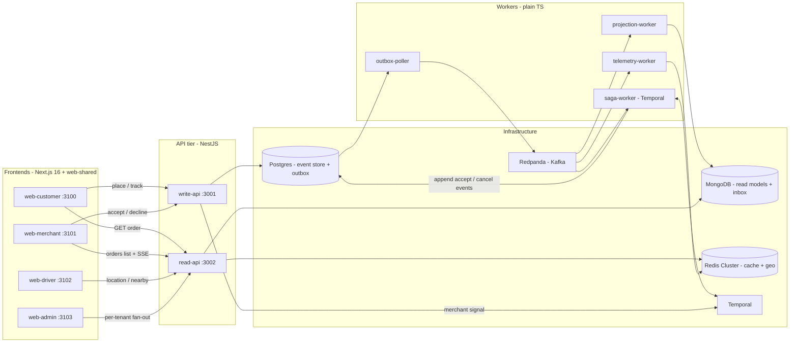
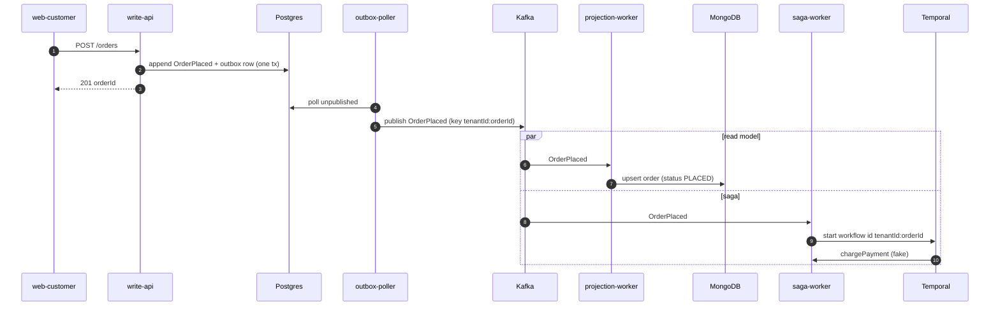
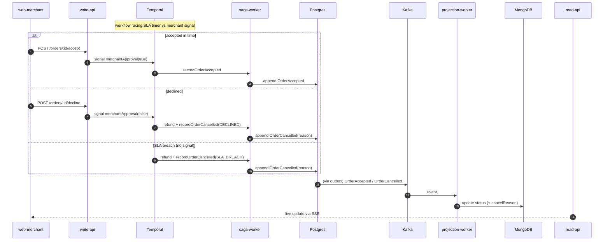
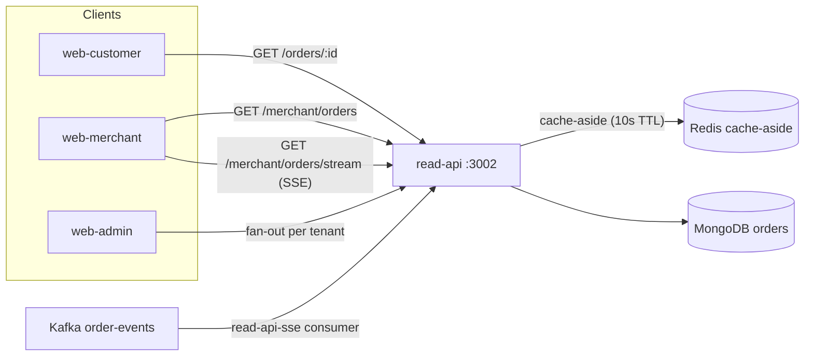
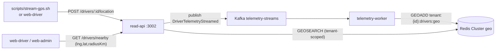
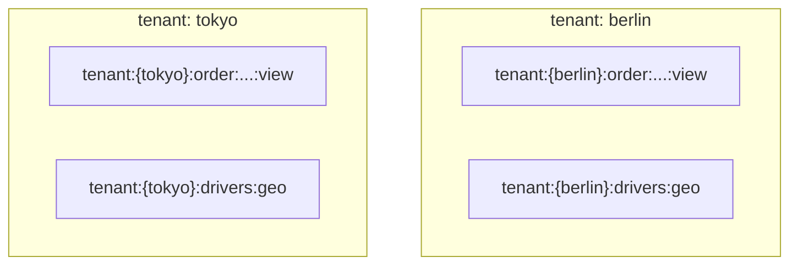

# FlashBite — Architecture (what's built so far)

This document describes the system **as currently implemented** (Phase 0 + Phase 1: the
walking-skeleton order plane, the telemetry plane, and all four Phase 1d frontends). It is
deliberately scoped to working code — a "Not yet built" section at the end lists what the master
spec still defers to later phases.

> Companion to the vision spec in
> [`docs/superpowers/specs/2026-06-13-flashbite-showcase-design.md`](superpowers/specs/2026-06-13-flashbite-showcase-design.md).
> Where the two disagree, **this document reflects the code**.

---

## 1. System overview

FlashBite is a pnpm monorepo of NestJS services, plain-TS workers, and Next.js frontends, over
Postgres / MongoDB / Redis Cluster / Redpanda (Kafka) / Temporal. It is **CQRS**: a write plane
(event-sourced) and a read plane (projected), joined by Kafka.

**Two independent planes:**

- **Order plane** (durable, event-sourced): everything from placing an order to its terminal
  status. Backed by Postgres (source of truth) + Mongo (read model).
- **Telemetry plane** (ephemeral): driver GPS pings into a Redis geo index. Never persisted to
  Postgres; not part of the order aggregate.

They are intentionally **disconnected today** — no backend assigns a driver to an order (that
"driver dispatch" loop is backlogged).

---

## 2. Components

| Component | Type | Port | Responsibility |
|---|---|---|---|
| `write-api` | NestJS | 3001 | Place orders (append `OrderPlaced` to the event store + outbox, atomically); relay merchant accept/decline as a Temporal signal. |
| `read-api` | NestJS | 3002 | Query orders (Mongo + Redis cache-aside); merchant SSE stream; telemetry ingest + `GET /drivers/nearby`. |
| `outbox-poller` | TS worker | — | Polls the Postgres outbox and publishes envelopes to Kafka (`order-events`). At-least-once. |
| `projection-worker` | TS worker | — | Consumes `order-events`, dedupes via a Mongo inbox, upserts the `orders` read model (version-guarded). |
| `saga-worker` | TS worker + Temporal | — | One workflow per order: charge → race SLA timer vs merchant approval → accept, or refund + cancel. |
| `telemetry-worker` | TS worker | — | Consumes `telemetry-streams`, `GEOADD`s drivers into the per-tenant Redis geo key. |
| `web-customer` | Next.js | 3100 | Storefront: menu, cart, checkout, live order tracking. |
| `web-merchant` | Next.js | 3101 | Order queue (live SSE), accept/decline. |
| `web-driver` | Next.js | 3102 | Go online, view nearby drivers on a Mapbox map (GPS streamed by a script). |
| `web-admin` | Next.js | 3103 | Cross-tenant operator grid: GMV/analytics charts, per-tenant driver maps, combined orders. |

**Shared packages:** `contracts` (event types, status/reason enums, topic + key helpers,
`OrderView`), `shared` (Prisma client, event-store/outbox append, Mongo + Redis clients, JSON
envelope builder), `tenant-context` (AsyncLocalStorage tenant scope + `X-Tenant-ID` middleware),
`web-shared` (design system, API client, stores, SSE hook, geo + analytics helpers).

---

## 3. Order lifecycle (write -> project -> saga)

Placing an order writes one event atomically with an outbox row; the outbox poller publishes it;
two consumers react independently — the projection updates the read model, the saga drives the
business workflow.

Then the workflow waits, racing a per-tenant SLA timer against the merchant's decision:

**Order status:** `PLACED -> ACCEPTED` or `PLACED -> CANCELLED` (`cancelReason` =
`SLA_BREACH` | `DECLINED`). The `web-customer` tracking page polls `GET /orders/:id`; the
`web-merchant` and `web-admin` views update live over SSE.

### Why it's "hard mode"

- **Transactional outbox:** the event and its outbox row commit in one Postgres transaction, so a
  crash can never publish an event that wasn't persisted (or vice versa).
- **Idempotency at every hop:** stable `eventId`; the projection's Mongo **inbox** skips
  re-delivered events; the saga starts workflows with `WorkflowId = tenantId:orderId` and a
  reject-duplicate reuse policy, so a re-delivered `OrderPlaced` can't double-charge.
- **Version-guarded projection:** the read model only moves forward (`existing.version < event.version`).
- **Saga compensation:** a decline or SLA breach triggers a refund activity before recording the
  cancellation — the textbook saga compensation shape (payment is a fake activity today).

---

## 4. Read plane (CQRS query side)

- **Cache-aside:** `GET /orders/:id` checks Redis (`tenant:{id}:order:<id>:view`, 10s TTL) before
  Mongo.
- **SSE:** read-api runs its own Kafka consumer (`read-api-sse` group) and pushes per-tenant order
  events to subscribers; the merchant dashboard and admin grid consume it. The frontend derives the
  real status from the event type (the wire event also carries `cancelReason` on cancel).
- **Admin fan-out:** there is **no cross-tenant endpoint**. `web-admin` loops the fixed tenants and
  calls the per-tenant endpoints, aggregating in the browser (an authenticated cross-tenant admin
  API is backlogged).

---

## 5. Telemetry plane (ephemeral geo)

Driver GPS is **simulated** (random-walk via `scripts/stream-gps.sh`, or the in-app emitter was
replaced by the script in 1d-iii). Ingest returns `202` and is fire-and-forget into Kafka; the
worker overwrites each driver's position (latest-wins). Because `GEOADD` only keeps the current
position, there is **no trajectory history** — durable history is a backlogged "telemetry-archiver"
concern. `web-driver` shows one tenant's nearby drivers; `web-admin` shows both tenants side by side.

---

## 6. Multi-tenancy & key model

Two tenants exist today — **berlin** and **tokyo** — to prove isolation.

- **Tenant resolution (current):** the `X-Tenant-ID` header, read by `tenant-context` middleware
  into an `AsyncLocalStorage` scope; every read-api/write-api route resolves `getTenantId()`. This
  is **trusted** for now — a verified-JWT identity service replaces it in Phase 2.
- **Postgres:** events/outbox carry `tenantId`; read-model `_id` is `tenantId:orderId`, inbox `_id`
  is `tenantId:consumer:eventId`.
- **Kafka:** partition key `tenantId:orderId` preserves per-order ordering.
- **Redis Cluster:** hash-tag keys co-locate a tenant's keys on one slot —
  `tenant:{id}:drivers:geo`, `tenant:{id}:order:<id>:view`. The brace wraps only the id so the key
  tree nests cleanly.

---

## 7. Frontends

All four Next.js apps reuse `@flashbite/web-shared` (shadcn/ui design system on Tailwind v4,
Manrope, the API client, `useTenantStore`, `useOrderStream` SSE hook, `DataTable`, geo + analytics
helpers). Each app proxies `/api/read/*` -> :3002 and `/api/write/*` -> :3001 via Next rewrites
(so the browser stays same-origin and can send `X-Tenant-ID`).

- **web-customer** — menu/cart/checkout, then a tracking page that polls until terminal status.
- **web-merchant** — a live order table (snapshot + SSE) with accept/decline and a detail sheet.
- **web-driver** — go online, poll `getNearbyDrivers` around the city center, render a Mapbox map +
  table (read-only viewer; GPS comes from the script).
- **web-admin** — cross-tenant grid: GMV/orders/cancelled/active-driver cards, four recharts charts
  (GMV-by-tenant, status breakdown, top SKUs, GMV-over-time), two per-tenant Mapbox maps, and a
  combined orders table with cancellation reasons. Live via one SSE connection per tenant + driver
  polling; all analytics computed in the browser from the per-tenant fan-out.

---

## 8. Testing

- **Backend (Jest):** unit + e2e suites that boot the NestJS apps against live infra (Mongo, Redis
  Cluster, Redpanda, Temporal) — projection, outbox round-trip, SSE, telemetry ingest/nearby, the
  SLA-breach saga e2e.
- **web-shared (Vitest):** the single frontend unit-test home — API client request shapes, order
  event helpers, geo + analytics helpers.
- **Frontends (Playwright):** per-app e2e against the running stack (e.g. the admin e2e seeds an
  order per tenant and asserts the cross-tenant fan-out renders). The web apps are excluded from the
  root Jest run.

---

## 9. Not yet built (planned / backlog)

These appear in the vision spec or `docs/superpowers/backlog.md` but are **not implemented**:

- **Identity service + verified JWT, Postgres Row-Level Security** — tenancy is a trusted header
  today (Phase 2).
- **Avro + Schema Registry** — envelopes are currently JSON (Phase 3 hardening).
- **Real payment provider** — charge/refund are fake Temporal activities.
- **Driver dispatch** — closing the order↔driver loop (saga assigns a nearby driver; driver
  accept/pickup/deliver).
- **Authenticated cross-tenant admin API** — replaces the client-side fan-out.
- **Telemetry-archiver + history store** — durable ping history for analytics / driver safety score.
- **Microfrontend shell** — composing the four apps into one product shell.
- **Push-based customer tracking** — replace the customer poll with SSE.
